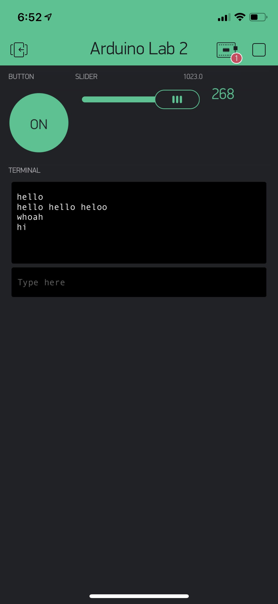

Name: Diego Davila

EID: dpd633

Team Number: F6

## Questions

1. What is the purpose of an IP address?

    Ip addresses serve as a naming mechanism that gives each machine a unique name (or identity).

2. What is a DNS? What are the benefits of using domain names instead of IP addresses?

    DNS maps a symbolic name with a corresponding IP address, making it easier for people to access since IP addresses are complicated and hard to remember.

3. What is the difference between a static IP and a dynamic IP?

    Dynamic IP can change while Static IP stays the same.

4. What is the tradeoff between UDP and TCP protocols?

    UDP is faster but less reiable form of communication, but TCP is slower than UDp but it's more reliable.

5. Why can't we use the delay function with Blynk?

    Blynk is event based, meaning that using the delay function would break up the timing of Blynk.

6. What does it mean for a function to be "Blocking"?

    Nothing else can run while it's running.

7. Why are interrupts useful for writing Non-Blocking code?

    They are useful because they only execute when they are called and immediately return to the original program. 

8. What is the difference between interface and implementation? Why is it important?

   Interface defines how a function is called and implemntation describes what the fuction actually does. It's important because the function will only ba called when needed to do a certain task rather than always performing the task even if you didn't want it to. 

9. Screenshot of your Blynk App:

    
